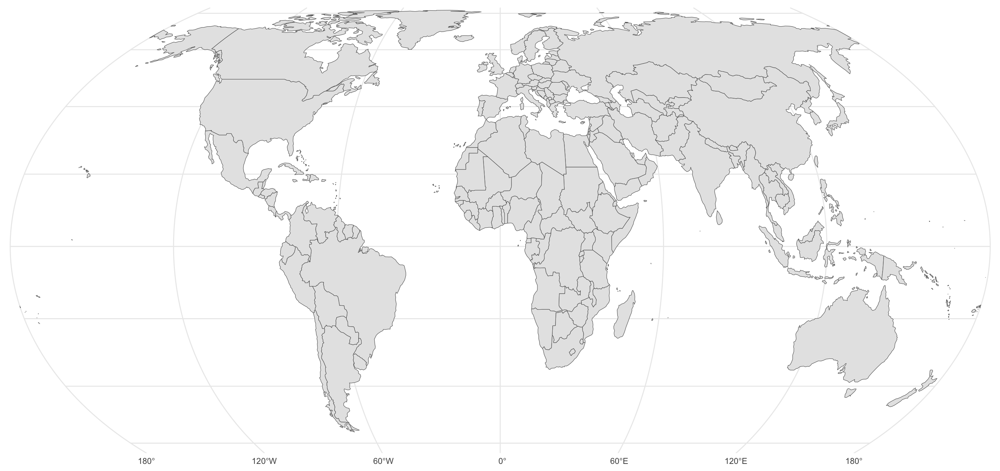

# BIPA cartography

The `cartography` folder contains the code and output files for the base map
used in visualisation of the Blavatnik Index of Public Administration's results.



## Disclaimer

The use of codes, classifications, names, cartographic data and maps by the
Blavatnik Index of Public Administration for purely analytical purposes, the
inclusion or non-inclusion of a country, territory or geographic entity does
not indicate a formal position by the Blavatnik School of Government or the
University of Oxford on the legal status of any country, state, territory or
geographic feature nor does it indicate an endorsement by the Blavatnik School
of Government or the University of Oxford of any claim of sovereignty over any
country, state, territory or geographic feature.

## Background

Web-based mapping services largely rely on the excellent
[Natural Earth](http://naturalearthdata.com) dataset. Natural Earth's standard
mapping utilises a *de facto* approach for assigning territorial control:

> Natural Earth draws boundaries of sovereign states according to de facto
> (“in fact”) status rather than de jure (“by law”). ... While our de facto
> policy does not please everyone, it is rigorous and self consistent.
> 
> _Natural Earth's [disputed boundaries policy](https://www.naturalearthdata.com/about/disputed-boundaries-policy/)_

Neither a purely *de facto* or *de jure* approach suits our needs for mapping.
The data and scripts in this folder produce a custom world map based on Natural
Earth source data. Furthermore, many web mapping sources remove small island
countries from their display, our output map retains at least one polygon
for each island state. However, most island territories and dependencies are
removed for aesthetic reasons, similarly continental European micro-states
are also excluded for aesthetic reasons.

## Licence

Please see the licensing section of the main [README](../README.md#Licence)
for the repository.

## General workflow

1.  Download the [Source data](#1-source-data)
2.  Process [merges and output exclusions](#2-merges-and-output-exclusions)
      - [Output exclusions and inclusions](#output-exclusions-and-inclusions)
      - [Aesthetic modifications](#aesthetic-modifications)
          - [Merges of contiguous subunits](#merges-of-continguous-subunits)
          - [Indeterminate or disputed land](#indeterminate-or-disputed-land)
      - [Jurisdictional modifications](#jurisdictional-modifications)
          - [Cyprus and Northern Cyprus](#cyprus-and-northern-cyprus)
          - [Israel, Palestine, Lebanon and Syria](#israel-palestine-lebanon-and-syria)
          - [Kosovo](#kosovo)
          - [Somalia and Somaliland](#somalia-and-somaliland)
          - [Taiwan](#taiwan)
          - [Ukraine](#ukraine)
          - [Western Sahara](#western-sahara)
3.  Apply [simplification](#3-simplification)
      - [Continental countries and large islands](#continental-countries-and-large-islands)
      - [Small island entities](#small-island-entities)
4.  Create [output files](#4-ouput-files)

## 1. Source data

The principal source is Natural Earth's 1:10m resolution mapping, using the
`ne_10m_admin_0_map_subunits` and the `ne_10m_admin_0_disputed_areas` datasets.

These are downloaded via the script `1_get_src_ne.R` from the Natural Earth
[Github repository](https://github.com/nvkelso/natural-earth-vector/). These
are downloaded to the `cartography/src` subfolder but owing to their size
are not checked into the repository.

The source data was last retrieved from the Natural Earth repository at
`2024-06-27 XX:XX UTC`, this is version `5.1.1` of the Natural Earth sources.

[^ Back to workflow](#general-workflow)

## 2. Merges and output exclusions

The `subunits` dataset is not a dataset of formal/administrative sub-national
entities such as states, provinces or regions (this is provided in the
`ne_10m_admin_1_states_provinces` dataset).

Instead it provides 360 cartographic 'subunits', many of these sub-units are
for handling overseas territories and island dependencies, but these are not
the only types of examples, for example:

- The contiguous 48 states of the USA are included as one entity while the
  states of the Alaska and Hawaii are included separately.
- The European and Asian parts of Russia are included as separate entities.
- Some contiguous sub-national administrative entities are included as separate
  entities, for example the three federal regions of Belgium.
- De-militarised areas, for example the United Nations Buffer Zone
  ("green line") in Cyprus.
- Disputed or indeterminate land, many of these are small island/marine
  features such as the Spratly Islands in the South China Sea claimed by
  several countries, however some of these are on continental land
  masses such as the Southern Patagonian Ice Field (subject to claims by
  Argentina and Chile) or the unclaimed land of Bir Tarwil (between Egypt
  and Sudan).

The script `2_proc_merges_output.R` makes several modifications to the
`subunits` file from which the output maps are produced. There are three types
of modifications that are made:

- [Output exclusions and inclusions](#output-exclusions-and-inclusions) -
  entities in `subunits` which are either explicitly excluded or included.
- [Aesthetic modifications](#aesthetic-modifications) - merges of contiguous
  sub-units for aesthetic purposes.
- [Jurisdictional modifications](#jurisdictional-modifications) -
  re-aggregations for handling _de facto_ and _de jure_ determinations.

All mapping and cartographic choices within this repository are aimed at
helping data visualisation, as per the disclaimer they should not be inferred
as an official position on the final or legal status of any territorial claims
or recognition of such claims.

[^ Back to workflow](#general-workflow)

### Output exclusions and inclusions

There are 118 geographic entities in `subunits` which are excluded for
aesthetic simplification of the output map:

- 3 are subunits related to Antarctica — the Antarctic continent, Peter I
  Island and the South Orkney Islands.
- 72 are small island(s) entities that are autonomous, overseas or
  dependent territories — e.g. Bermuda or the Faroe Islands.
- 5 are indeterminate or disputed island(s) territories — Bajo Nuevo Bank
  (Petrel Is.), Brazilian Island, Scarborough Reef, Serranilla Bank, and
  Spratly Islands.
- 26 are are small island(s) entities that are not territories with special
  administrative status — e.g. the Shetland Islands of the United Kingdom or
  the Ryukyu Islands of Japan.
- 5 are small coastal territories — the two special administrative
  regions of China (Hong Kong and Macau), the two autonomous cities of Spain
  on the north African coast (Ceuta and Melilla) and the US Naval Base
  Guantanamo Bay on the island of Cuba.
- 5 are European microstates — Andorra, Liechtenstein, Monaco, San Marino and
  the Vatican City.

Four large external/overseas territories have been retained for aesthetic
reasons: French Guiana, Greenland, Puerto Rico, and Svalbard.

[^ Back to workflow](#general-workflow)

### Aesthetic modifications

These modifications have been made to assist with the simplification of the
high-resolution cartographic source data to a low-resolution output map and
the desire to produce approximately contiguous boundaries between countries and
territories on land masses. The subsequent step of simplification tends to
obscure determinations about indeterminate or disputed land

[^ Back to workflow](#general-workflow)

#### Merges of continguous subunits

The following subunits are contiguous parts of the same sovereign state and
are merged to produce a unified entity in the output mapping.

- Belgium (`BEL`): The three regions of Belgium (Brussels Capital Region,
  Flanders and Wallonia) have been merged.
- Bosnia and Herzegovina (`BIH`): The three subunits of Bosnia and Herzegovina
  (the Federation of Bosnia and Herzegovina, the Republic Srpska and the
  Brčko District) have been merged.
- Georgia (`GEO`): The autonomous republic of Adjara has been merged with the
  rest of Georgia.
- Iraq (`IRQ`): The autonomous Kurdistan Region has been merged with the rest
  of Iraq.
- Kazakhstan (`KAZ`): The Baikonur Cosmodrome lease area has been merged with
  the rest of Kazakhstan.
- North Korea (`PRK`): The northern part of the Korea Demilitarized Zone has
  been merged with the rest of North Korea.
- Russia (`RUS`): The Natural Earth source data splits contiguous Russia into
  European and Asian halves, these have been merged. See also Russia and
  Ukraine in the section on
  [jurisdictional modifications](#jurisdictional-modifications) below.
- Serbia (`SRB`): The autonomous province of Vojvodina has been merged with the
  rest of Serbia.
- South Korea (`KOR`): The southern part of the Korea Demilitarized Zone has
  been merged with the rest of South Korea.
- United Kingdom (`GBR`): The three constituent countries of the UK on the
  island of Great Britain have been merged.

#### Indeterminate or disputed land

As outlined [above](#output-exclusions-and-inclusions), indeterminate or
disputed island(s) territories have been excluded from the mapping.

There are three indeterminate disputed territories on continental land
masses that have been merged with neighbouring states for aesthetic purposes.
This does not endorse any specific territorial claim/position with regard to
the sovereignty of these lands and has been done with the aim of ensuring the
land masses of Africa, Asia and South America appear contiguous in the output
mapping.

- Argentina (`ARG`): The Southern Patagonian Ice Field has been merged with
  Argentina.
- Pakistan (`PAK`): The Siachen Glacier has been merged with Pakistan.
- Sudan (`SDN`): The unclaimed land of Bir Tawil has been merged with Sudan.

[^ Back to workflow](#general-workflow)

### Jurisdictional modifications

The Natural Earth dataset uses what it defines as a _de facto_ approach
(rather than a _de jure_ approach) assigning geographic territory to countries
and other entities. Within our processing of the cartographic data we have
taken a mixed approach on a case by case basis, in part to reflect the presence
or not of these entities within the source data for the Blavatnik Index of
Public Administration.

- Cyprus (`CYP`): For aesthetic simplification the UN Buffer Zone in Cyprus
  and the UK sovereign base areas (Akrotiri and Dhekelia) have been merged with
  the subunit covering the area of the island of Cyprus controlled by the
  Republic of Cyprus. See also Northern Cyprus (`XNC`) below.
- Israel (`ISR`): Israel is shown exclusive of the Palestinian territories of
  the Gaza Strip and the West Bank, but inclusive of the Golan Heights.
- Kosovo (`XKK`): Kosovo is shown as a distinct entity.
- Morocco (`MAR`): See Western Sahara (`ESH`) below.
- Northern Cyprus (`XNC`): The territory claimed by the Turkish Republic of
  Northern Cyprus, i.e. territory north of the UN Buffer Zone ("Green line") is
  shown as a distinct entity. See also Cyprus (`CYP`) above.
- Russia (`RUS`): See Ukraine (`UKR`) below.
- Palestine (`PSE`): The Palestinian territories of the Gaza Strip and West
  Bank are displayed separately from the State of Israel.
- Somalia (`SOM`): The subunits of Puntland and Somalila have been merged.
- Somaliland (`XSL`): Somaliland is shown as a distinct entity.
- Syria (`SYR`): The territory of the UN Disengagement Observer Force (UNDOF)
  has been merged with Syria.
- Taiwan (`TWN`): Taiwan is shown distinct entity.
- Ukraine (`UKR`): The peninsula of Crimea is included with Ukraine.
- Western Sahara (`ESH`): Western Sahara is shown as a distinct entity.

Where _de facto_ judgements are made these have been largely based on the
positions taken in the Natural Earth data, either explicitly in their
documentation or implicitly from comparisons of differences in their
published datasets.

A secondary source to help make considerations and decisions is the World
Bank's [interactive mapping](https://maps.worldbank.org), since it is the
published of several of the data sources used by the Index. However, note
that the World Bank has its own disclaimers regarding territory regarding
the illustrative nature of its mapping and that its mapping does not "imply,
on the part of the World Bank Group, any judgement on the legal status of
any territory, or any endorsement or acceptance of such boundaries".

[^ Back to workflow](#general-workflow)

#### Cyprus and Northern Cyprus

A largely _de facto_ approach has been taken with regards to territory on the
island of Cyprus. While Northern Cyprus is only formally recognised by Türkyie
the division of the island of Cyprus has lasted for 50 years and therefore
data relating to the Republic of Cyprus in many of the Index's data source will
not apply to the territory north of the UN Buffer Zone ("Green line"). As a
result, the _de facto_ territory controlled by the Republic of Cyprus (`CYP`)
and the Turkish Republic of Northern Cyprus (`XNC`) are shown separately.

To aid aesthetic simplification the areas of the UN Buffer Zone, and the UK
Sovereign Base Areas of Akrotiri and Dhekelia have been merged with the subunit
for covering the Republic of Cyprus. These choices do not represent an official
position on territorial and jurisdictional sovereignty over any territory on
the island of Cyprus.

[^ Back to workflow](#general-workflow)

#### Israel, Palestine, Lebanon and Syria

The absence of a lasting settlement in regards to the Israel-Palestine and
Arab-Israeli conflict neither a purely _de facto_ or _de jure_ approach has
been taken. As per other mapping and cartography choices made in this
repository, choices here guided the primary aim of an aesthetically simple map
for data visualisation. These choices do not represent an official position
on territorial and jurisdictional sovereignty over any territory in Israel,
Palestine, Lebanon or Syria.

Between 1994 and 2007 many of the functions of national governments have been
performed by the Palestinian Authority in the West Bank and Gaza. Since 2007
in Gaza these functions have been administered by institutions led by Hamas
rather than the Palestinian Authority, which continues to administer land in
Area A and Area B of the West Bank. Land in Area C of the West Bank is fully
administered by Israel. Owing to the Oslo Accords some functions of national
government continue to be administered by Israel on behalf of the Palestinian
territories (e.g. aspects of tax administration).

In several of the data sources for the Index data for the State of Palestine
is provided separately from that of the State of Israel. As a result the
territories of the West Bank and Gaza are shown separately from territories
the State of Israel, based on the 1967 boundaries.

The territory of the Golan Heights claimed by Lebanon and Syria and occupied
by Israel has been included with the rest of Israel on a _de facto_ basis. The
territory administered by UN Disengagement Observer Force (UNDOF) has been
merged with Syria.

[^ Back to workflow](#general-workflow)

#### Kosovo

A _de facto_ approach has been taken with regards to the Republic of Kosovo
as it is included in several of the Index's data sources.

[^ Back to workflow](#general-workflow)

#### Somalia and Somaliland

A _de facto_ approach has been taken with regards to the territory of Somalia
and Somaliland based on the Natural Earth dataset. While Somaliland is an
unrecognised state and exists in only one of the Index's source data, the aim
of the Index is to compare national-level public administrations. Other data
sources while including Somalia exclude the territory of Somalialand from their
considerations.

As such the territory of Somaliland is shown a distinct entity, while a
_de jure_ approach has been taken to merge the subunits for the subunit of
Puntland with the rest of Somalia.

[^ Back to workflow](#general-workflow)

#### Taiwan

A _de facto_ approach has been taken with regards to Taiwan as it is included
in several of the Index's data sources.

[^ Back to workflow](#general-workflow)

#### Ukraine

Owing to the continuing conflict between Ukraine and Russia following the
annexation of Crimea by Russia in 2014 and ongoing military activity in the
rest of Ukraine since 2022, and in recognition of resolutions by the UN
General Assembly in support of the territorial integrity of Ukraine (notably
resolutions A/RES/68/262, A/RES/ES-11/4), a _de jure_ appproach has been taken
with regards to the territory of Ukraine.

These choices do not represent an official position on the territorial and
jurisdictional sovereignty over territory in Ukraine or Russia.

[^ Back to workflow](#general-workflow)

#### Western Sahara

Neither a _de jure_ or _de facto_ approach has been taken with regards to
Western Sahara.

Western Sahara is the largest area included in the UN's list of
[_Non-Self-Governing Territories_](https://www.un.org/dppa/decolonization/en/nsgt)
and the UN General Assembly's position is that "the question of Western Sahara
was a question of decolonization which remained to be completed by the people
of Western Sahara". Spain, the former colonial administrator, has had no
presence in the territory since 1976, it would therefore not make sense to use
a _de jure_ approach and treat it as an overseas, dependent or otherwise
connected territory of Spain. There is an ongoing dispute between Morocco and
the Sahrawi Arab Democratic Republic over control of the territory and its
future status as either an independent state or part of Morocco.

The approach of the World Bank is followed, whereby Western Sahara is shown as
a distinct entity covering the area south of 27.66ºN, east of the borders of
Algeria, and north and east of the borders of Mauritania.

[^ Back to workflow](#general-workflow)

## 3. Simplification

After merging and processing the output exclusions and inclusions the raw
cartography data is then passed through simplification algorithms to reduce
the file size. The script `3_proc_simplify.R` handles the simplification
process and produces the output file.

Simplification is performed using the
[Mapshaper library](https://github.com/mbloch/mapshaper) via the 
[`{rmapshaper}` package](https://cran.r-project.org/package=rmapshaper).

The simplification is split into three stages:

- simplification of countries on continental landmasses and large island
  entities
- simplification of small island entities
- combination of the two geometries and correct winding issues

### Continental countries and large islands

For large geographic entities there is a three-step process for simplification:

1. Pass the geometry data through the Mapshaper algorithm with no
   simplification to repair drawing errors (e.g. small holes) created during
   the merge and output processing.
2. Pass the geometry data through the Douglas-Peuker algorithm to reduce the
   point density of the geometry data, keeping approximately 10% of points.
3. Pass the geometry data through the Visvalingam algorithm to further
   simplify the map while also smoothing the output, keeping approximately
   15% of points (or 1.5% of the original points at stage 1).
   
### Small island entities

For small island entities there is a one_step process for simplification which
uses the unweighted Visvalingam algorithm to retain 15% of the original points.

[^ Back to workflow](#general-workflow)

### Ouput files

The final version of the map in GeoJSON format is contained at
`out/world_lowres.geojson`.

The geometry is converted to [TopoJSON](https://github.com/topojson/topojson)
and quantized to produce a lightweight file (~127KB). This is done via the
command line using the `topojson-server` and `topojson-client` NPM packages.

```bash
$ geo2topo world=world_lowres.geojson > world_lowres.topojson
$ topoquantize 1e5 world_lowres.topojson > world_lowres.topojson
```

The TopoJSON is stored as `out/world_lowres.topojson`.

[^ Back to workflow](#general-workflow)